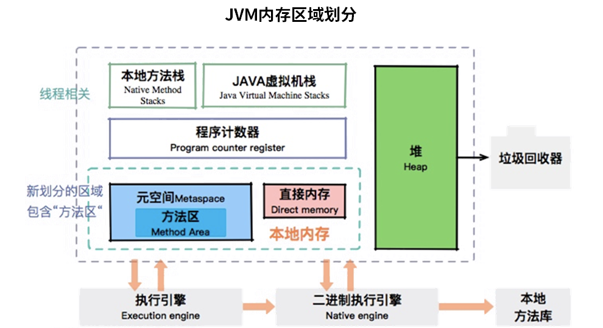
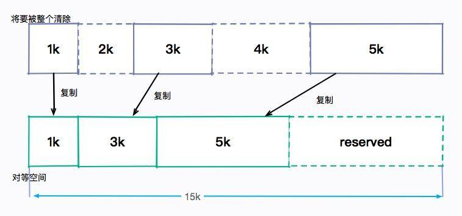
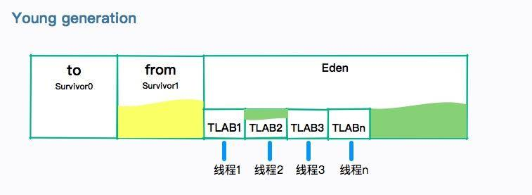
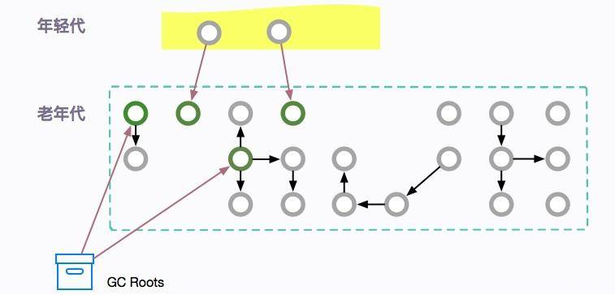
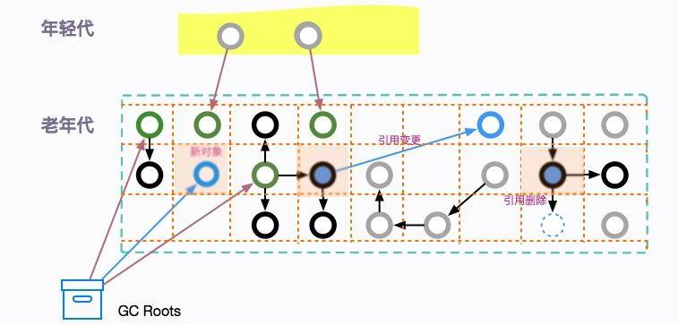
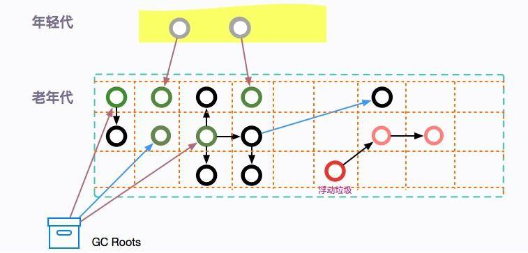
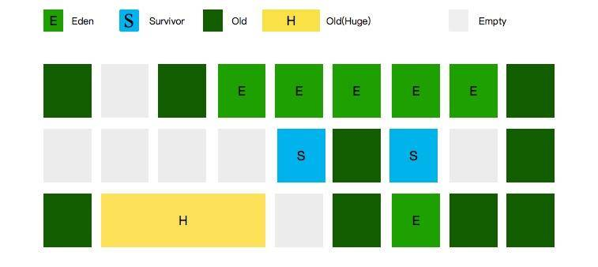
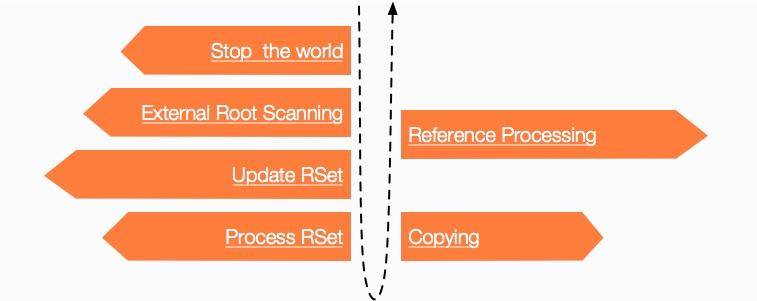

# JVM

## 1.  JVM 内存布局




> JVM 内存区域划分如图所示，从图中我们可以看出：
>
> - JVM 堆中的数据是共享的，是占用内存最大的一块区域。
> - 可以执行字节码的模块叫作执行引擎。
> - 执行引擎在线程切换时怎么恢复？依靠的就是程序计数器。
> - JVM 的内存划分与多线程是息息相关的。像我们程序中运行时用到的栈，以及本地方法栈，它们的维度都是线程。
> - 本地内存包含元数据区和一些直接内存。


## 2. 虚拟机栈

> 栈是什么样的数据结构？ 类似于子弹上膛。
>
> Java 虚拟机栈是基于线程的。哪怕你只有一个 main() 方法，也是以线程的方式运行的。在线程的生命周期中，参与计算的数据会频繁地入栈和出栈，栈的生命周期是和线程一样的。
>
> 栈里的每条数据，就是栈帧。
>
> 每个栈帧，都包含四个区域：
>
> - 局部变量表
> - 操作数栈
> - 动态连接
> - 返回地址
>
> 


## 3. 程序计数器

> 程序计数器是一块较小的内存空间，它的作用可以看作是当前线程所执行的字节码的行号指示器。


## 4. 堆


> * 堆是 JVM 上最大的内存区域，我们申请的几乎所有的对象，都是在这里存储的。
> * Java 的对象可以分为基本数据类型和普通对象。 对于普通对象来说，JVM 会首先在堆上创建对象，然后在其他地方使用的其实是它的引用。比如，把这个引用保存在虚拟机栈的局部变量表中。 对于基本数据类型来说（byte、short、int、long、float、double、char)，有两种情况。 我们上面提到，每个线程拥有一个虚拟机栈。当你在方法体内声明了基本数据类型的对象，它就会在栈上直接分配。其他情况，都是在堆上分配。
> * int[] 数组这样的内容，是在堆上分配的。数组并不是基本数据类型。


## 5. 元空间

> 这个区域存储的内容，包括：类的信息、常量池、方法数据、方法代码。


# 类加载机制

## 1. 类加载过程

> 类的加载过程非常复杂，主要有这几个过程：加载、验证、准备、解析、初始化
>
> 
>
> #### 加载
>
> 加载的主要作用是将外部的 .class 文件，加载到 Java 的方法区内，你可以回顾一下我们在上一课时讲的内存区域图。加载阶段主要是找到并加载类的二进制数据，比如从 jar 包里或者 war 包里找到它们。
>
> 
>
> #### 验证
>
> 肯定不能任何 .class 文件都能加载，那样太不安全了，容易受到恶意代码的攻击。验证阶段在虚拟机整个类加载过程中占了很大一部分，不符合规范的将抛出 java.lang.VerifyError 错误。像一些低版本的 JVM，是无法加载一些高版本的类库的，就是在这个阶段完成的。
>
> 
>
> #### 准备
>
> 从这部分开始，将为一些类变量分配内存，并将其初始化为默认值。此时，实例对象还没有分配内存，所以这些动作是在方法区上进行的。
>
> 
>
> #### 解析
>
> 解析在类加载中是非常非常重要的一环，是将符号引用替换为直接引用的过程。
>
> 
>
> #### 初始化
>
> 如果前面的流程一切顺利的话，接下来该初始化成员变量了。


### 2. 类加载器

> 整个类加载过程任务非常繁重，虽然这活儿很累，但总得有人干。类加载器做的就是上面 5 个步骤的事。

#### 几个类加载器

> - Bootstrap ClassLoader
>
> 这是加载器中的大 Boss，任何类的加载行为，都要经它过问。它的作用是加载核心类库，也就是 rt.jar、resources.jar、charsets.jar 等。当然这些 jar 包的路径是可以指定的，-Xbootclasspath 参数可以完成指定操作。这个加载器是 C++ 编写的，随着 JVM 启动。
>
> - Extention ClassLoader
>
> 扩展类加载器，主要用于加载 lib/ext 目录下的 jar 包和 .class 文件。同样的，通过系统变量 java.ext.dirs 可以指定这个目录。这个加载器是个 Java 类，继承自 URLClassLoader。
>
> - App ClassLoader
>
> 这是我们写的 Java 类的默认加载器，有时候也叫作 System ClassLoader。一般用来加载 classpath 下的其他所有 jar 包和 .class 文件，我们写的代码，会首先尝试使用这个类加载器进行加载。
>
> - Custom ClassLoader
>
> 自定义加载器，支持一些个性化的扩展功能。


## 3. 双亲委派机制

> 双亲委派机制的意思是除了顶层的启动类加载器以外，其余的类加载器，在加载之前，都会委派给它的父加载器进行加载。这样一层层向上传递，直到祖先们都无法胜任，它才会真正的加载。


# GC

- Minor GC：发生在年轻代的 GC。
- Major GC：发生在老年代的 GC。
- Full GC：全堆垃圾回收。比如 Metaspace 区引起年轻代和老年代的回收。

## 1. GC Roots

> 垃圾回收，首先就需要找到这些垃圾，然后回收掉。但是 GC 过程正好相反，它是先找到活跃的对象，然后把其他不活跃的对象判定为垃圾，然后删除。所以垃圾回收只与活跃的对象有关，和堆的大小无关。


> 垃圾回收就是围绕着 GC Roots 去做的。同时，它也是很多内存泄露的根源，因为其他引用根本没有这样的权利。
>
> 那么，什么样的对象，才会是 GC Root 呢？这不在于它是什么样的对象，而在于它所处的位置。
>
> **GC Roots有哪些**
>
> GC Roots 是一组必须活跃的引用。
>
> - Java 线程中，当前所有正在被调用的方法的引用类型参数、局部变量、临时值等。也就是与我们栈帧相关的各种引用。
> - 所有当前被加载的 Java 类。
> - Java 类的引用类型静态变量。
> - 运行时常量池里的引用类型常量（String 或 Class 类型）。
> - JVM 内部数据结构的一些引用，比如 sun.jvm.hotspot.memory.Universe 类。
> - 用于同步的监控对象，比如调用了对象的 wait() 方法。
> - JNI handles，包括 global handles 和 local handles。
>
> 这些 GC Roots 大体可以分为三大类
>
> - 活动线程相关的各种引用。
> - 类的静态变量的引用。
> - JNI 引用。


**引用级别**

>**强引用 Strong references**
>
>当内存空间不足，系统撑不住了，JVM 就会抛出 OutOfMemoryError 错误。即使程序会异常终止，这种对象也不会被回收
>
>
>
>**软引用 Soft references**
>
>软引用用于维护一些可有可无的对象。在内存足够的时候，软引用对象不会被回收，只有在内存不足时，系统则会回收软引用对象，如果回收了软引用对象之后仍然没有足够的内存，才会抛出内存溢出异常。
>
>
>
>**弱引用 Weak references**
>
>弱引用对象相比较软引用，要更加无用一些，它拥有更短的生命周期。当 JVM 进行垃圾回收时，无论内存是否充足，都会回收被弱引用关联的对象。
>
>
>
>**虚引用 Phantom References**
>
>这是一种形同虚设的引用，在现实场景中用的不是很多。虚引用必须和引用队列（ReferenceQueue）联合使用。如果一个对象仅持有虚引用，那么它就和没有任何引用一样，在任何时候都可能被垃圾回收。


## 2. GC算法

### 2.1 标记（Mark）

> 垃圾回收的第一步，就是找出活跃的对象。我们反复强调 GC 过程是逆向的。
>
> 如图所示，圆圈代表的是对象。绿色的代表 GC Roots，红色的代表可以追溯到的对象。可以看到标记之后，仍然有多个灰色的圆圈，它们都是被回收的对象。


### 2.2 清除（Sweep）

> 清除阶段就是把未被标记的对象回收掉。
>
> 
>
> 但是这种简单的清除方式，有一个明显的弊端，那就是碎片问题。


### 2.3 复制（Copy）

> 解决碎片问题没有银弹，只有老老实实的进行内存整理。
>
> 有一个比较好的思路可以完成这个整理过程，就是提供一个对等的内存空间，将存活的对象复制过去，然后清除原内存空间。




### 2.4 整理（Compact）

> 其实，不用分配一个对等的额外空间，也是可以完成内存的整理工作。
>
> 你可以把内存想象成一个非常大的数组，根据随机的 index 删除了一些数据。那么对整个数组的清理，其实是不需要另外一个数组来进行支持的，使用程序就可以实现。
>
> 它的主要思路，就是移动所有存活的对象，且按照内存地址顺序依次排列，然后将末端内存地址以后的内存全部回收。


## 3. 分带

### 3.1 年轻代

> 年轻代使用的垃圾回收算法是复制算法。因为年轻代发生 GC 后，只会有非常少的对象存活，复制这部分对象是非常高效的。


> 当年轻代中的 Eden 区分配满的时候，就会触发年轻代的 GC（Minor GC）。具体过程如下：
>
> - 在 Eden 区执行了第一次 GC 之后，存活的对象会被移动到其中一个 Survivor 分区（以下简称from）；
> - Eden 区再次 GC，这时会采用复制算法，将 Eden 和 from 区一起清理。存活的对象会被复制到 to 区；接下来，只需要清空 from 区就可以了。

> TLAB 的全称是 **Thread Local Allocation Buffer**，JVM 默认给每个线程开辟一个 buffer 区域，用来加速对象分配。这个 buffer 就放在 Eden 区中。
>
> 这个道理和 Java 语言中的 ThreadLocal 类似，避免了对公共区的操作，以及一些锁竞争。





### 3.2 老年代

> 老年代一般使用“标记-清除”、“标记-整理”算法，因为老年代的对象存活率一般是比较高的，空间又比较大，拷贝起来并不划算，还不如采取就地收集的方式。

> 对象是怎么进入老年代的呢？
>
> **（1）提升（Promotion）**
>
> 如果对象够老，会通过“提升”进入老年代。每当发生一次 Minor GC，存活下来的对象年龄都会加 1。
>
> 参数 **‐XX:+MaxTenuringThreshold** 进行配置，最大值是 15。
>
> **（2）分配担保**
>
> 看一下年轻代的图，每次存活的对象，都会放入其中一个幸存区，这个区域默认的比例是 10%。但是我们无法保证每次存活的对象都小于 10%，当 Survivor 空间不够，就需要依赖其他内存（指老年代）进行分配担保。这个时候，对象也会直接在老年代上分配。
>
> **（3）大对象直接在老年代分配**
>
> 超出某个大小的对象将直接在老年代分配。这个值是通过参数 -XX:PretenureSizeThreshold 进行配置的。默认为 0，意思是全部首选 Eden 区进行分配。
>
> **（4）动态对象年龄判定**
>
> 有的垃圾回收算法，并不要求 age 必须达到 15 才能晋升到老年代，它会使用一些动态的计算方法。


### 3.3 卡片标记（card marking）

> 你可以看到，对象的引用关系是一个巨大的网状。有的对象可能在 Eden 区，有的可能在老年代，那么这种跨代的引用是如何处理的呢？由于 Minor GC 是单独发生的，如果一个老年代的对象引用了它，如何确保能够让年轻代的对象存活呢？
>
> 对于是、否的判断，我们通常都会用 Bitmap（位图）和布隆过滤器来加快搜索的速度。
>
> JVM 也是用了类似的方法。其实，老年代是被分成众多的卡页（card page）的（一般数量是 2 的次幂）。
>
> 卡表（Card Table）就是用于标记卡页状态的一个集合，每个卡表项对应一个卡页。
>
> 如果年轻代有对象分配，而且老年代有对象指向这个新对象， 那么这个老年代对象所对应内存的卡页，就会标识为 dirty，卡表只需要非常小的存储空间就可以保留这些状态。
>
> 垃圾回收时，就可以先读这个卡表，进行快速判断。


## 4. 垃圾回收器

### 4.1 年轻代垃圾回收器

> **（1）Serial 垃圾收集器**
>
> 处理 GC 的只有一条线程，并且在垃圾回收的过程中暂停一切用户线程。
>
> 这可以说是最简单的垃圾回收器，但千万别以为它没有用武之地。因为简单，所以高效，它通常用在客户端应用上。因为客户端应用不会频繁创建很多对象，用户也不会感觉出明显的卡顿。相反，它使用的资源更少，也更轻量级。
>
> **（2）ParNew 垃圾收集器**
>
> ParNew 是 Serial 的多线程版本。由多条 GC 线程并行地进行垃圾清理。清理过程依然要停止用户线程。
>
> ParNew 追求“低停顿时间”，与 Serial 唯一区别就是使用了多线程进行垃圾收集，在多 CPU 环境下性能比 Serial 会有一定程度的提升；但线程切换需要额外的开销，因此在单 CPU 环境中表现不如 Serial。
>
> **（3）Parallel Scavenge 垃圾收集器**
>
> 另一个多线程版本的垃圾回收器。它与 ParNew 的主要区别是：
>
> - Parallel Scavenge：追求 CPU 吞吐量，能够在较短时间内完成指定任务，适合没有交互的后台计算。弱交互强计算。
> - ParNew：追求降低用户停顿时间，适合交互式应用。强交互弱计算。


### 4.2 老年代垃圾回收器

> **（1）Serial Old 垃圾收集器**
>
> 与年轻代的 Serial 垃圾收集器对应，都是单线程版本，同样适合客户端使用。
>
> 年轻代的 Serial，使用复制算法。
>
> 老年代的 Old Serial，使用标记-整理算法。
>
> **（2）Parallel Old**
>
> Parallel Old 收集器是 Parallel Scavenge 的老年代版本，追求 CPU 吞吐量。
>
> **（3）CMS 垃圾收集器**
>
> CMS（Concurrent Mark Sweep）收集器是以获取最短 GC 停顿时间为目标的收集器，它在垃圾收集时使得用户线程和 GC 线程能够并发执行，因此在垃圾收集过程中用户也不会感到明显的卡顿。我们会在后面的课时详细介绍它。
>
> 长期来看，CMS 垃圾回收器，是要被 G1 等垃圾回收器替换掉的。在 Java8 之后，使用它将会抛出一个警告。
>
> （4）G1 垃圾收集器
>
> （5）ZGC 垃圾收集器


**配置参数**

> - **-XX:+UseSerialGC** 年轻代和老年代都用串行收集器
> - **-XX:+UseParNewGC** 年轻代使用 ParNew，老年代使用 Serial Old
> - **-XX:+UseParallelGC** 年轻代使用 ParallerGC，老年代使用 Serial Old
> - **-XX:+UseParallelOldGC** 新生代和老年代都使用并行收集器
> - **-XX:+UseConcMarkSweepGC**，表示年轻代使用 ParNew，老年代的用 CMS
> - **-XX:+UseG1GC** 使用 G1垃圾回收器
> - **-XX:+UseZGC** 使用 ZGC 垃圾回收器


### 4.3 STW

> 如果在垃圾回收的时候（不管是标记还是整理复制），又有新的对象进入怎么办？
>
> 为了保证程序不会乱套，最好的办法就是暂停用户的一切线程。也就是在这段时间，你是不能 new 对象的，只能等待。表现在 JVM 上就是短暂的卡顿，什么都干不了。这个头疼的现象，就叫作 Stop the world。简称 STW。
>
> 标记阶段，大多数是要 STW 的。如果不暂停用户进程，在标记对象的时候，有可能有其他用户线程会产生一些新的对象和引用，造成混乱。


## 5. CMS垃圾回收器

> CMS 的全称是 Mostly Concurrent Mark and Sweep Garbage Collector（主要并发­标记­清除­垃圾收集器），它在年轻代使用**复制**算法，而对老年代使用**标记-清除**算法。你可以看到，在老年代阶段，比起 Mark-Sweep，它多了一个并发字样。
>
> CMS 使用的是 Sweep 而不是 Compact，所以它的主要问题是碎片化。随着 JVM 的长时间运行，碎片化会越来越严重，只有通过 Full GC 才能完成整理。
>
> 为什么 CMS 能够获得更小的停顿时间呢？主要是因为它把最耗时的一些操作，做成了和应用线程并行。


### 5.1 CMS 回收过程

**初始标记（Initial Mark）**

> 初始标记阶段，只标记直接关联 GC root 的对象，不用向下追溯。因为最耗时的就在 tracing 阶段，这样就极大地缩短了初始标记时间。
>
> 这个过程是 STW 的，但由于只是标记第一层，所以速度是很快的。
>
> 


**并发标记（Concurrent Mark）**

> 在初始标记的基础上，进行并发标记。这一步骤主要是 tracinng 的过程，用于标记所有可达的对象。
>
> 这个过程会持续比较长的时间，但却可以和用户线程并行。在这个阶段的执行过程中，可能会产生很多变化：
>
> - 有些对象，从新生代晋升到了老年代；
> - 有些对象，直接分配到了老年代；
> - 老年代或者新生代的对象引用发生了变化。
>
> 
>
> 在这个阶段受到影响的老年代对象所对应的卡页，会被标记为 dirty，用于后续重新标记阶段的扫描。


**并发预清理（Concurrent Preclean）**

> 并发预清理也是不需要 STW 的，目的是为了让重新标记阶段的 STW 尽可能短。这个时候，老年代中被标记为 dirty 的卡页中的对象，就会被重新标记，然后清除掉 dirty 的状态。
>
> 由于这个阶段也是可以并发的，在执行过程中引用关系依然会发生一些变化。我们可以假定这个清理动作是第一次清理。
>
> 所以重新标记阶段，有可能还会有处于 dirty 状态的卡页。


**并发可取消的预清理（Concurrent Abortable Preclean）**

> 因为重新标记是需要 STW 的，所以会有很多次预清理动作。并发可取消的预清理，顾名思义，在满足某些条件的时候，可以终止，比如迭代次数、有用工作量、消耗的系统时间等。
>
> 这个阶段是可选的。换句话说，这个阶段是“并发预清理”阶段的一种优化。
>
> 这个阶段的第一个意图，是避免回扫年轻代的大量对象；另外一个意图，就是当满足最终标记的条件时，自动退出。


**最终标记（Final Remark）**

> 通常 CMS 会尝试在年轻代尽可能空的情况下运行 Final Remark 阶段，以免接连多次发生 STW 事件。
>
> 这是 CMS 垃圾回收阶段的第二次 STW 阶段，目标是完成老年代中所有存活对象的标记。我们前面多轮的 preclean 阶段，一直在和应用线程玩追赶游戏，有可能跟不上引用的变化速度。本轮的标记动作就需要 STW 来处理这些情况。


**并发清除（Concurrent Sweep）**

> 此阶段用户线程被重新激活，目标是删掉不可达的对象，并回收它们的空间。
>
> 由于 CMS 并发清理阶段用户线程还在运行中，伴随程序运行自然就还会有新的垃圾不断产生，这一部分垃圾出现在标记过程之后，CMS 无法在当次 GC 中处理掉它们，只好留待下一次 GC 时再清理掉。这一部分垃圾就称为“浮动垃圾”。
>
> 


**并发重置（Concurrent Reset）**

> 此阶段与应用程序并发执行，重置 CMS 算法相关的内部数据，为下一次 GC 循环做准备


### 5.2 内存碎片

> 由于 CMS 在执行过程中，用户线程还需要运行，那就需要保证有充足的内存空间供用户使用。如果等到老年代空间快满了，再开启这个回收过程，用户线程可能会产生“Concurrent Mode Failure”的错误，这时会临时启用 Serial Old 收集器来重新进行老年代的垃圾收集，这样停顿时间就很长了（STW）。

> 这部分空间预留，一般在 30% 左右即可，那么能用的大概只有 70%。参数 -XX:CMSInitiatingOccupancyFraction 用来配置这个比例（记得要首先开启参数UseCMSInitiatingOccupancyOnly）。也就是说，当老年代的使用率达到 70%，就会触发 GC 了。如果你的系统老年代增长不是太快，可以调高这个参数，降低内存回收的次数。


### 5.3 CMS.sh

```shell
#!/bin/bash
set -x

service_path=$(cd "$(dirname "$0")" ; cd ../; pwd)
service=`echo "$service_path" | awk -F "/" '{print $(NF)}'`
echo "start service : $service , path : $service_path"
jar_name="$service_path/$service.jar"

if [ -f $jar_name ]; then
 echo "$jar_name is exists!"
else
 echo "$jar_name is not exists !"
fi

running_count=`ps -ef | grep "${jar_name}" | grep -v "grep" | wc -l`
if [ $running_count -gt 0 ]; then
    echo "service($service) already running, skip lauch."
    exit 1
fi


JAVA_OPTS="${JAVA_OPTS} -Xmx1024m -Xms1024m -XX:MetaspaceSize=128m -XX:MaxMetaspaceSize=256m"
JAVA_OPTS="${JAVA_OPTS} -XX:+UseParNewGC"
JAVA_OPTS="${JAVA_OPTS} -XX:+UseConcMarkSweepGC"
JAVA_OPTS="${JAVA_OPTS} -XX:ParallelGCThreads=6"
JAVA_OPTS="${JAVA_OPTS} -XX:SurvivorRatio=8"
# 并行运行最终标记阶段，加快最终标记的速度
JAVA_OPTS="${JAVA_OPTS} -XX:+CMSParallelRemarkEnabled"
# 设置触发CMS老年代回收的内存使用率占比
JAVA_OPTS="${JAVA_OPTS} -XX:CMSInitiatingOccupancyFraction=70"
# 经过几次CMS Full GC的时候整理一次碎片
JAVA_OPTS="${JAVA_OPTS} -XX:CMSFullGCsBeforeCompaction=5"
# 在进行Full GC时对内存进行压缩
JAVA_OPTS="${JAVA_OPTS} -XX:+UseCMSCompactAtFullCollection"
JAVA_OPTS="${JAVA_OPTS} -XX:+PrintHeapAtGC"
JAVA_OPTS="${JAVA_OPTS} -XX:+PrintGCDetails"
JAVA_OPTS="${JAVA_OPTS} -XX:+PrintGCDateStamps"
JAVA_OPTS="${JAVA_OPTS} -Xloggc:$service_path/logs/gc-$(date +%Y%m%d-%H%M).log"
JAVA_OPTS="${JAVA_OPTS} -XX:+HeapDumpOnOutOfMemoryError"
JAVA_OPTS="${JAVA_OPTS} -XX:HeapDumpPath=${service_path}/logs/heap-dump.hprof"

exec java $JAVA_OPTS -jar $jar_name & 
```


## 6. G1垃圾回收器

> G1 的全称是 Garbage­First GC, G1 的目标是用来干掉 CMS 的。



> 如图所示，G1 也是有 Eden 区和 Survivor 区的概念的，只不过它们在内存上不是连续的，而是由一小份一小份组成的。
>
> 这一小份区域的大小是固定的，名字叫作小堆区（Region）。小堆区可以是 Eden 区，也可以是 Survivor 区，还可以是 Old 区。所以 G1 的年轻代和老年代的概念都是逻辑上的。
>
> 每一块 Region，大小都是一致的，它的数值是在 1M 到 32M 字节之间的一个 2 的幂值数。
>
> 但假如我的对象太大，一个 Region 放不下了怎么办？注意图中有一块面积很大的黄色区域，它的名字叫作 Humongous Region，大小超过 Region 50% 的对象，将会在这里分配。
>
> Region 的大小，可以通过参数进行设置：-XX:G1HeapRegionSize=M


### 6.1 G1 的垃圾回收过程

> 在逻辑上，G1 分为年轻代和老年代，但它的年轻代和老年代比例，并不是那么“固定”，为了达到 MaxGCPauseMillis 所规定的效果，G1 会自动调整两者之间的比例。
>
> 如果你强行使用 -Xmn 或者 -XX:NewRatio 去设定它们的比例的话，我们给 G1 设定的这个目标将会失效。
>
> G1 的回收过程主要分为 3 类：
>
> （1）G1“年轻代”的垃圾回收，同样叫 Minor GC，这个过程和我们前面描述的类似，发生时机就是 Eden 区满的时候。
>
> （2）老年代的垃圾收集，严格上来说其实不算是收集，它是一个“并发标记”的过程，顺便清理了一点点对象。
>
> （3）真正的清理，发生在“混合模式”，它不止清理年轻代，还会将老年代的一部分区域进行清理。


### 6.2 RSet

> RSet 是一个空间换时间的数据结构。
>
> 全称是 Remembered Set，用于记录和维护 Region 之间的对象引用关系。
>
> 但 RSet 与 Card Table 有些不同的地方。Card Table 是一种 points-out（我引用了谁的对象）的结构。而 RSet 记录了其他 Region 中的对象引用本 Region 中对象的关系，属于 points-into 结构（`谁引用了我的对象`）
>
> 可以把 RSet 理解成一个 Hash，key 是引用的 Region 地址，value 是引用它的对象的卡页集合。
>
> 
>
> 对于年轻代的 Region，它的 RSet 只保存了来自老年代的引用，这是因为年轻代的回收是针对所有年轻代 Region 的，没必要画蛇添足。所以说年轻代 Region 的 RSet 有可能是空的。
>
> 而对于老年代的 Region 来说，它的 RSet 也只会保存老年代对它的引用。这是因为老年代回收之前，会先对年轻代进行回收。这时，Eden 区变空了，而在回收过程中会扫描 Survivor 分区，所以也没必要保存来自年轻代的引用。
>
> RSet 通常会占用很大的空间，大约 5% 或者更高。不仅仅是空间方面，很多计算开销也是比较大的。
>
> 事实上，为了维护 RSet，程序运行的过程中，写入某个字段就会产生一个 post-write barrier 。为了减少这个开销，将内容放入 RSet 的过程是异步的，而且经过了很多的优化：Write Barrier 把脏卡信息存放到本地缓冲区（local buffer），有专门的 GC 线程负责收集，并将相关信息传给被引用 Region 的 RSet。
>
> 参数 -XX:G1ConcRefinementThreads 或者 -XX:ParallelGCThreads 可以控制这个异步的过程。如果并发优化线程跟不上缓冲区的速度，就会在用户进程上完成。


### 6.3 具体回收过程

> G1 还有一个 CSet 的概念。这个就比较好理解了，它的全称是 Collection Set，即收集集合，保存一次 GC 中将执行垃圾回收的区间（Region）

**年轻代回收**

> 年轻代回收是一个 STW 的过程，它的跨代引用使用 RSet 数据结构来追溯，会一次性回收掉年轻代的所有 Region。
>
> JVM 启动时，G1 会先准备好 Eden 区，程序在运行过程中不断创建对象到 Eden 区，当所有的 Eden 区都满了，G1 会启动一次年轻代垃圾回收过程。
>
> 
>
> （1）扫描根
>
> 根，可以看作是GC Roots，加上 RSet 记录的其他 Region 的外部引用。
>
> （2）更新 RS
>
> 处理 dirty card queue 中的卡页，更新 RSet。此阶段完成后，RSet 可以准确的反映老年代对所在的内存分段中对象的引用。可以看作是第一步的补充。
>
> （3）处理 RS
>
> 识别被老年代对象指向的 Eden 中的对象，这些被指向的 Eden 中的对象被认为是存活的对象。
>
> （4）复制对象
>
> 在这个阶段，对象树被遍历，Eden 区内存段中存活的对象会被复制到 Survivor 区中空的 Region。这个过程和其他垃圾回收算法一样，包括对象的年龄和晋升。
>
> （5）处理引用
>
> 处理 Soft、Weak、Phantom、Final、JNI Weak 等引用。结束收集。


### 6.4 并发标记（Concurrent Marking）

> 当整个堆内存使用达到一定比例（默认是 45%），并发标记阶段就会被启动。这个比例也是可以调整的，通过参数 -XX:InitiatingHeapOccupancyPercent 进行配置。
>
> Concurrent Marking 是为 Mixed GC 提供标记服务的，并不是一次 GC 过程的一个必须环节。这个过程和 CMS 垃圾回收器的回收过程非常类似
>
> （1）初始标记（Initial Mark）
>
> ​	这个过程共用了 Minor GC 的暂停，这是因为它们可以复用 root scan 操作。虽然是 STW 的，但是时间通常非常短。
>
> （2）Root 区扫描（Root Region Scan）
>
> （3）并发标记（ Concurrent Mark）
>
> ​	这个阶段从 GC Roots 开始对 heap 中的对象标记，标记线程与应用程序线程并行执行，并且收集各个 Region 的存活对象信息。
>
> （4）重新标记（Remaking）
>
> 和 CMS 类似，也是 STW 的。标记那些在并发标记阶段发生变化的对象。
>
> （5）清理阶段（Cleanup）
>
> 这个过程不需要 STW。如果发现 Region 里全是垃圾，在这个阶段会立马被清除掉。不全是垃圾的 Region，并不会被立马处理，它会在 Mixed GC 阶段，进行收集。


### 6.5 混合回收（Mixed GC）

> 能并发清理老年代中的整个整个的小堆区是一种最优情形。混合收集过程，不只清理年轻代，还会将一部分老年代区域也加入到 CSet 中。
>
> 通过 Concurrent Marking 阶段，我们已经统计了老年代的垃圾占比。在 Minor GC 之后，如果判断这个占比达到了某个阈值，下次就会触发 Mixed GC。这个阈值，由 -XX:G1HeapWastePercent 参数进行设置（默认是堆大小的 5%）。因为这种情况下， GC 会花费很多的时间但是回收到的内存却很少。所以这个参数也是可以调整 Mixed GC 的频率的。
>
> 还有参数 G1MixedGCCountTarget，用于控制一次并发标记之后，最多执行 Mixed GC 的次数。


### 6.6 G1.sh

```shell
#!/bin/bash
set -x

service_path=$(cd "$(dirname "$0")" ; cd ../; pwd)
service=`echo "$service_path" | awk -F "/" '{print $(NF)}'`
echo "start service : $service , path : $service_path"
jar_name="$service_path/$service.jar"

if [ -f $jar_name ]; then
 echo "$jar_name is exists!"
else
 echo "$jar_name is not exists !"
fi

running_count=`ps -ef | grep "${jar_name}" | grep -v "grep" | wc -l`
if [ $running_count -gt 0 ]; then
    echo "service($service) already running, skip lauch."
    exit 1
fi


JAVA_OPTS="${JAVA_OPTS} -Xmx1024m -Xms1024m -XX:MetaspaceSize=128m -XX:MaxMetaspaceSize=256m"
#堆内存大小
JAVA_OPTS="${JAVA_OPTS} -Xmx512m -Xms256m"
# 年轻代和年老代比例为1:2 G1垃圾回收期 如果指定NewRatio 或-Xmn参数 则G1 设定的这个目标 即MaxGCPauseMillis失效
#JAVA_OPT="${JAVA_OPT} -XX:NewRatio=2"
# Region size  heapSize/2048 Region size必须是2的指数 取值范围从1M到32M
JAVA_OPTS="${JAVA_OPTS} -XX:G1HeapRegionSize=4m"
# 元数据空间, 默认为20M
JAVA_OPTS="${JAVA_OPTS} -XX:MetaspaceSize=40m"
# 最大元数据空间 注意：metaspace太小会引起full gc
JAVA_OPTS="${JAVA_OPTS} -XX:MaxMetaspaceSize=40m"
# MaxTenuringThreshold设置垃圾的最大年龄. 默认为15 年轻代经历gc进入年老代的年龄
JAVA_OPTS="${JAVA_OPTS} -XX:MaxTenuringThreshold=10"
# 采用G1垃圾回收器
JAVA_OPTS="${JAVA_OPTS} -XX:+UseG1GC"
# 当堆内存的使用率达到45%之后就会自动启动G1的并发垃圾回收 默认为45
JAVA_OPTS="${JAVA_OPTS} -XX:InitiatingHeapOccupancyPercent=45"
# 每次GC最大的停顿毫秒数
JAVA_OPTS="${JAVA_OPTS} -XX:MaxGCPauseMillis=200"
# gc日志打印 -> 输出详细GC日志；打印gc发生的时间戳；打印gc前后堆栈情况；可以生成更详细的Survivor空间占用日志；定义GC Log 的滚动功能；生成gc文件的数量；gc-log日志大小；gc日志路径
JAVA_OPTS="${JAVA_OPTS} -XX:+PrintHeapAtGC"
JAVA_OPTS="${JAVA_OPTS} -XX:+PrintGCDetails"
JAVA_OPTS="${JAVA_OPTS} -XX:+PrintGCDateStamps"
JAVA_OPTS="${JAVA_OPTS} -Xloggc:$service_path/logs/gc-$(date +%Y%m%d-%H%M).log"
JAVA_OPTS="${JAVA_OPTS} -XX:+HeapDumpOnOutOfMemoryError"
JAVA_OPTS="${JAVA_OPTS} -XX:HeapDumpPath=${service_path}/logs/heap-dump.hprof"

exec java $JAVA_OPTS -jar $jar_name & 
```

